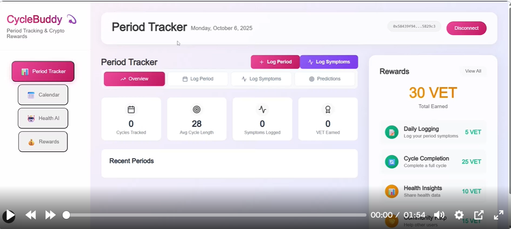

# CycleBuddy 💫

**The app that helps teens & women manage their periods while earning crypto for doing so**

[](https://opensource.org/licenses/MIT)
[](https://nextjs.org/)
[](https://vechain.org/)
[](https://soliditylang.org/)



# Demo Link :
  PART 1 :- [https://youtu.be/kprEJEetfLk?si=HSfoSW1Mx0r_YvL-](https://youtu.be/kprEJEetfLk?si=HSfoSW1Mx0r_YvL-)
  PART 2 :- [https://youtu.be/TlMwi2c2rlU](https://youtu.be/TlMwi2c2rlU)

## 🎯 Problem Statement

**Current Period Tracking Apps:**
- Users provide valuable health data for free
- No compensation for data sharing
- Limited privacy control over personal health information
- Apps monetize user data without user benefit

**Our Solution:**
- **Data Ownership**: Users own and control their health data
- **Crypto Rewards**: Earn B3TR tokens for health tracking activities
- **Privacy-First**: Decentralized approach with user-controlled data
- **Sustainable Model**: Users get rewarded for contributing to health research

## ✨ Features

### 🏥 Health Tracking
- **Period Logging**: Track start/end dates with 1 B3TR reward
- **Symptom Tracking**: Log pain levels, mood, flow intensity for 1 B3TR
- **Mood Check-ins**: Daily emotional well-being tracking for 1 B3TR
- **Medication Reminders**: Track birth control, pain relief for 1 B3TR

### 💰 Crypto Rewards System
- **Daily Cap**: Up to 4 B3TR tokens per day (1 per activity)
- **Anti-Double-Spend**: Bitmap tracking prevents duplicate rewards
- **VeChain Integration**: Seamless wallet connection and token distribution
- **Transparent Rewards**: All transactions recorded on blockchain

### 🔒 Privacy & Security
- **User-Controlled Data**: You own your health data
- **Decentralized Storage**: No central authority controlling your information
- **Blockchain Transparency**: All reward distributions are verifiable
- **VeChain Social Login**: Easy wallet connection without compromising security

## 🚀 User Flow

```
┌─────────────────┐    ┌──────────────────┐    ┌─────────────────┐
│   Landing Page  │───▶│  Connect Wallet  │───▶│   Dashboard     │
│                 │    │  (VeChain)       │    │                 │
└─────────────────┘    └──────────────────┘    └─────────────────┘
         │                       │                       │
         ▼                       ▼                       ▼
┌─────────────────┐    ┌──────────────────┐    ┌─────────────────┐
│  View Features  │    │  Social Login    │    │  Track Period   │
│  & Rewards      │    │  or Create New   │    │  & Symptoms     │
└─────────────────┘    └──────────────────┘    └─────────────────┘
                                                         │
                                                         ▼
┌─────────────────┐    ┌──────────────────┐    ┌─────────────────┐
│  View B3TR      │◀───│  Earn Rewards    │◀───│  Daily Insights │
│  Balance        │    │  (1 B3TR each)   │    │  & Predictions  │
└─────────────────┘    └──────────────────┘    └─────────────────┘
```

## 🏗️ Codebase Architecture

```
cyclebuddyapp/
├── 📁 cyclebuddy/                 # Next.js Frontend
│   ├── 📁 src/
│   │   ├── 📁 app/
│   │   │   ├── 📁 landing/        # Landing page components
│   │   │   ├── 📁 pages/          # App pages
│   │   │   ├── layout.tsx         # VeChain dApp Kit provider
│   │   │   └── globals.css        # Tailwind CSS styles
│   │   ├── 📁 components/         # Reusable components
│   │   ├── 📁 types/              # TypeScript definitions
│   │   └── 📁 utils/              # Utility functions
│   ├── package.json               # Frontend dependencies
│   └── tailwind.config.js         # Tailwind configuration
│
├── 📁 contract/                   # Smart Contracts
│   ├── 📁 contracts/
│   │   ├── CycleBuddyRewards.sol  # Main rewards contract
│   │   ├── 📁 mocks/              # Mock contracts for testing
│   │   └── 📁 templates/          # Base contract templates
│   ├── 📁 scripts/
│   │   └── 📁 deploy/             # Deployment scripts
│   ├── hardhat.config.ts          # Hardhat configuration
│   └── package.json               # Contract dependencies
│
└── 📁 docs/                       # Documentation
```

## 🔗 Smart Contracts

### CycleBuddyRewards.sol

**Main Features:**
- **Activity Tracking**: Bitmap-based daily activity tracking
- **Reward Distribution**: 1 B3TR per activity via X2Earn Rewards Pool
- **Anti-Double-Spend**: Prevents duplicate rewards per day
- **Admin Controls**: Configurable rewards and role management

**Key Functions:**
```solidity
// Reward distribution functions
function rewardPeriodLogging(address user) external onlyRole(DISTRIBUTOR_ROLE)
function rewardSymptomTracking(address user) external onlyRole(DISTRIBUTOR_ROLE)
function rewardMoodCheckin(address user) external onlyRole(DISTRIBUTOR_ROLE)
function rewardMedication(address user) external onlyRole(DISTRIBUTOR_ROLE)

// Admin functions
function setConfig(IX2EarnRewardsPool _rewardsPool, bytes32 _appId, uint256 _rewardPerActivity, uint256 _maxDailyActivities) external onlyRole(CONFIG_ROLE)

// View functions
function hasCompleted(address user, uint256 dayIndex, uint8 flag) public view returns (bool)
function dailyCount(address user, uint256 dayIndex) public view returns (uint256)
```

**Activity Bitmap System:**
```solidity
// Activity flags
uint8 private constant ACT_PERIOD_LOGGING = 1 << 0; // 0001
uint8 private constant ACT_SYMPTOM_TRACK = 1 << 1;  // 0010
uint8 private constant ACT_MOOD_CHECKIN = 1 << 2;   // 0100
uint8 private constant ACT_MEDICATION = 1 << 3;     // 1000

// User activity tracking
mapping(address => mapping(uint256 => uint8)) public userDayActivityBitmap;
```

### Contract Integration Flow

```
┌─────────────────┐    ┌──────────────────┐    ┌─────────────────┐
│   User Action   │───▶│ CycleBuddyRewards│───▶│ X2Earn Rewards  │
│  (Track Period) │    │    Contract      │    │     Pool        │
└─────────────────┘    └──────────────────┘    └─────────────────┘
         │                       │                       │
         ▼                       ▼                       ▼
┌─────────────────┐    ┌──────────────────┐    ┌─────────────────┐
│  Frontend App   │    │  Check Daily     │    │  Distribute     │
│  (Next.js)      │    │  Activity Bitmap │    │  1 B3TR Token   │
└─────────────────┘    └──────────────────┘    └─────────────────┘
         │                       │                       │
         ▼                       ▼                       ▼
┌─────────────────┐    ┌──────────────────┐    ┌─────────────────┐
│  VeChain Wallet │    │  Update Bitmap   │    │  User Receives  │
│  Connection     │    │  (Prevent Double)│    │  B3TR Tokens    │
└─────────────────┘    └──────────────────┘    └─────────────────┘
```

## 💎 B3TR Token Rewards

### Reward Structure
- **Period Logging**: 1 B3TR per day
- **Symptom Tracking**: 1 B3TR per day  
- **Mood Check-ins**: 1 B3TR per day
- **Medication Reminders**: 1 B3TR per day
- **Daily Maximum**: 4 B3TR tokens per user per day

### Reward Distribution Process
1. **User Action**: User logs period/symptoms/mood/medication
2. **Frontend Validation**: App validates user input
3. **Smart Contract Call**: Frontend calls reward function
4. **Bitmap Check**: Contract checks if user already earned for this activity today
5. **Reward Distribution**: If eligible, 1 B3TR is distributed via X2Earn Rewards Pool
6. **Bitmap Update**: User's daily activity bitmap is updated
7. **Event Emission**: `ActivityRewarded` event is emitted

### Anti-Double-Spend Mechanism
```solidity
function _rewardIfFirstToday(address user, uint8 flag) internal nonReentrant {
    uint256 dayIndex = currentDayIndex();
    uint8 bitmap = userDayActivityBitmap[user][dayIndex];
    
    // Skip if already rewarded for this activity today
    if ((bitmap & flag) != 0) {
        return;
    }
    
    // Enforce daily cap
    uint256 count = dailyCount(user, dayIndex);
    require(count < maxDailyActivities, "daily cap reached");
    
    // Mark completed and distribute reward
    userDayActivityBitmap[user][dayIndex] = bitmap | flag;
    rewardsPool.distributeReward(appId, rewardPerActivity, user, "");
}
```

## 🛠️ Tech Stack

### Frontend
- **Framework**: Next.js 15.2.4
- **Language**: TypeScript
- **Styling**: Tailwind CSS
- **Wallet Integration**: VeChain dApp Kit
- **UI Components**: Custom components with Tailwind
- **State Management**: React hooks

### Blockchain
- **Network**: VeChain Thor
- **Smart Contracts**: Solidity 0.8.20
- **Development**: Hardhat
- **Testing**: Hardhat test suite
- **Deployment**: Hardhat deployment scripts

### Infrastructure
- **Package Manager**: npm/yarn
- **Version Control**: Git
- **Documentation**: Markdown
- **Code Quality**: ESLint, Prettier

## 🚀 Getting Started

### Prerequisites
- Node.js 18+ 
- npm or yarn
- Git
- VeChain wallet (VeWorld, Sync2, etc.)

### Installation

1. **Clone the repository**
```bash
git clone https://github.com/your-username/cyclebuddyapp.git
cd cyclebuddyapp
```

2. **Install frontend dependencies**
```bash
cd cyclebuddy
npm install
```

3. **Install contract dependencies**
```bash
cd ../contract
npm install
```

4. **Set up environment variables**
```bash
# In contract/.env
MNEMONIC="your twelve word mnemonic phrase goes here"
```

### Development

1. **Start the frontend development server**
```bash
cd cyclebuddy
npm run dev
```

2. **Deploy contracts (local)**
```bash
cd contract
npx hardhat run scripts/deploy/cyclebuddy.ts --network vechain_solo
```

3. **Deploy contracts (testnet)**
```bash
cd contract
npx hardhat run scripts/deploy/cyclebuddy.ts --network vechain_testnet
```

### Building for Production

1. **Build the frontend**
```bash
cd cyclebuddy
npm run build
```

2. **Deploy contracts to mainnet**
```bash
cd contract
npx hardhat run scripts/deploy/cyclebuddy.ts --network vechain_mainnet
```

## 📊 Contract Deployment

### Deployed Contracts
- **B3TR Mock Token**: ERC20 token for rewards
- **X2Earn Apps Registry**: App registration system
- **X2Earn Rewards Pool**: Token distribution pool
- **CycleBuddy Rewards**: Main rewards contract

### Deployment Script Features
- Automatic contract deployment
- App registration in X2Earn ecosystem
- Reward distributor role assignment
- Pool funding with 1M B3TR tokens
- Complete integration testing

## 🔐 Security Features

- **Access Control**: Role-based permissions (CONFIG_ROLE, DISTRIBUTOR_ROLE)
- **Reentrancy Protection**: All external calls protected
- **Input Validation**: Comprehensive parameter validation
- **Daily Limits**: Prevents reward abuse
- **Bitmap System**: Efficient and secure activity tracking

## 📈 Future Roadmap

### Phase 1: Core Features ✅
- [x] Basic period tracking
- [x] B3TR reward system
- [x] VeChain wallet integration
- [x] Smart contract deployment

### Phase 2: Enhanced Features 🚧
- [ ] Advanced cycle predictions
- [ ] Community features
- [ ] Health insights dashboard
- [ ] Mobile app development

### Phase 3: Ecosystem Expansion 🔮
- [ ] NFT rewards for milestones
- [ ] DeFi integration
- [ ] Cross-chain compatibility
- [ ] Research partnerships

## 🤝 Contributing

We welcome contributions! Please see our [Contributing Guidelines](CONTRIBUTING.md) for details.

### Development Setup
1. Fork the repository
2. Create a feature branch
3. Make your changes
4. Add tests if applicable
5. Submit a pull request

## 📄 License

This project is licensed under the MIT License - see the [LICENSE](LICENSE) file for details.

## 🙏 Acknowledgments

- **VeChain Foundation** for blockchain infrastructure
- **X2Earn Ecosystem** for rewards pool integration
- **OpenZeppelin** for secure smart contract libraries
- **Next.js Team** for the amazing React framework

## 📞 Support

- **Documentation**: [docs.cyclebuddy.app](https://docs.cyclebuddy.app)
- **Discord**: [discord.gg/cyclebuddy](https://discord.gg/cyclebuddy)
- **Twitter**: [@CycleBuddyApp](https://twitter.com/CycleBuddyApp)
- **Email**: support@cyclebuddy.app

---

**Built with ❤️ for women's health and crypto adoption**

*CycleBuddy - Where health meets blockchain* 💫
